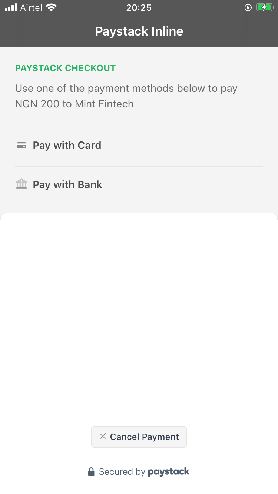
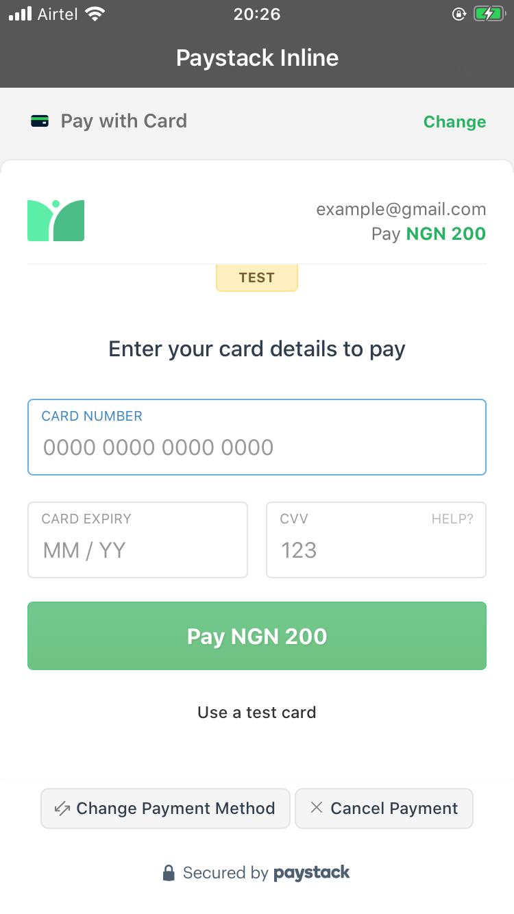
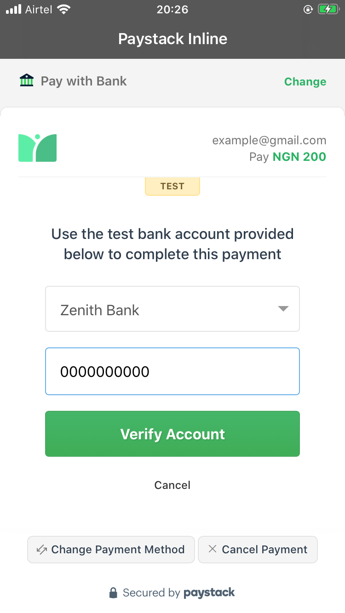

# Paystack Inline iOS
Integrating Paystack Inline on iOS using WebView.

# Why
Due to the much depenedencies of the native Paystack SDK, I tried to integrate the Paystack inline using just ViewController and WebView and this is waht I got.

